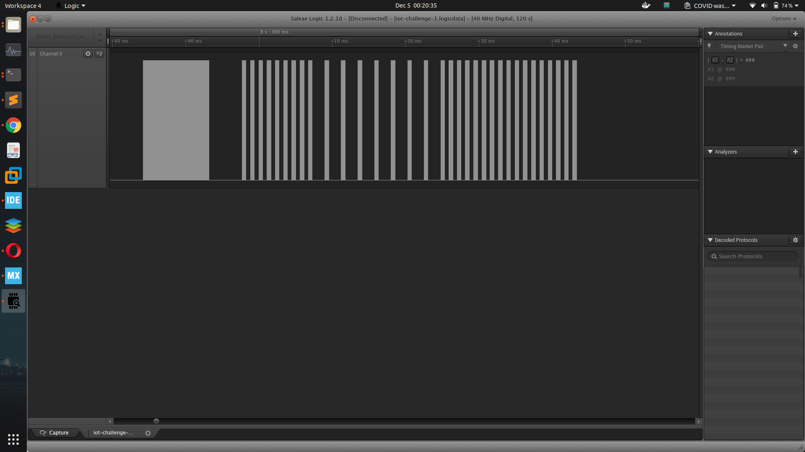
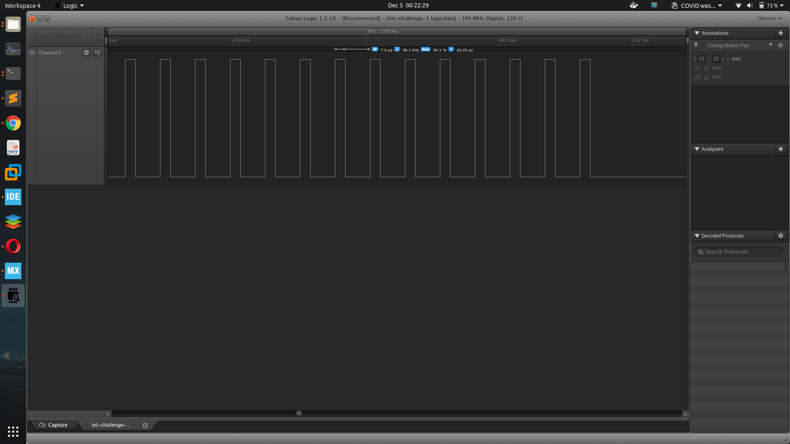
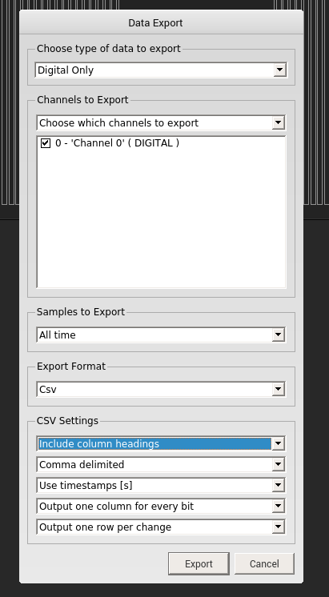

# COVID's Communication Technology
Internet Of Things

## Challenge 

We heard a rumor that COVID was leveraging that smart city's 'light' technology for communication. Find out in detail on the technology and what is being transmitted.

## Solution
 
We are given a Saleae Logic file (we know this from the file extension .logicdata)

Open it up in the program and you should see something like this.

If you zoom in, you will realise that this is a modulated signal.

Do a measurement for the signal and it is a 38kHz signal. From the challenge description, it mentions "light", which we can infer it is an IR communication protocol.

Unfortunately, in Saleae Logic, there is no way to decode the signal. Hence, I decided to manually decoded it in a Python script

First, we must export the file out of Saleae into something like a CSV file which is easy to work with.

In the top right you can export it (Option > Export). I exported the data into the CSV format with these settings.

Read up on this on the method to decode the signals. 

- https://arduino.stackexchange.com/questions/50964/infrared-frequency-recorded-with-saleae

I made some measurements and found out that these are the delay timings between each burst of the 38kHz modulation.

Measurement | Time
--- | ---
Between each character | 1 second
After initial burst | 4.5ms 
After a "low" burst | 0.55ms
After a "high" burst | 1.7ms 

I then wrote a python script to detect the time differences and convert it into binary and subsequently into ASCII.

	$ python3 parse.py

	b'govtech-csg{InfraRED_2020_CTf!@}govtech-csg{InfraRED_2020_CTf!@}govtech-csg{InfraRED_2020_CTf!@}govtech-csg{InfraRED_2020_CTf!@}govtech-csg{InfraRED_2020_CTf!@}govtech-csg{InfraRED_2020_'

## Flag

	govtech-csg{InfraRED_2020_CTf!@}
