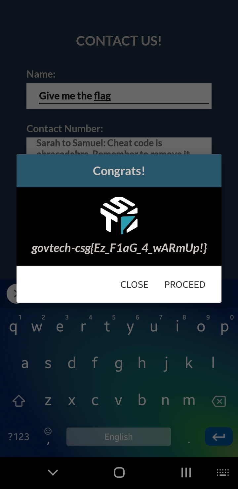

# Contact Us!
Mobile

## Challenge 

Looks like Korovax has exposed some development comment lines accidentally. Can you get one of the secrets through this mistake?

## Solution

Install the app.

Before starting up the app, do a logcat of the app.

	adb logcat --pid=`adb shell pidof -s sg.gov.tech.ctf.mobile`

Type "abracadabra" in the Contact Form. as the hint suggests.

Then in the logcat, we see a message which tells us to type in "Give me the flag"

## Flag

	govtech-csg{Ez_F1aG_4_wARmUp!}
