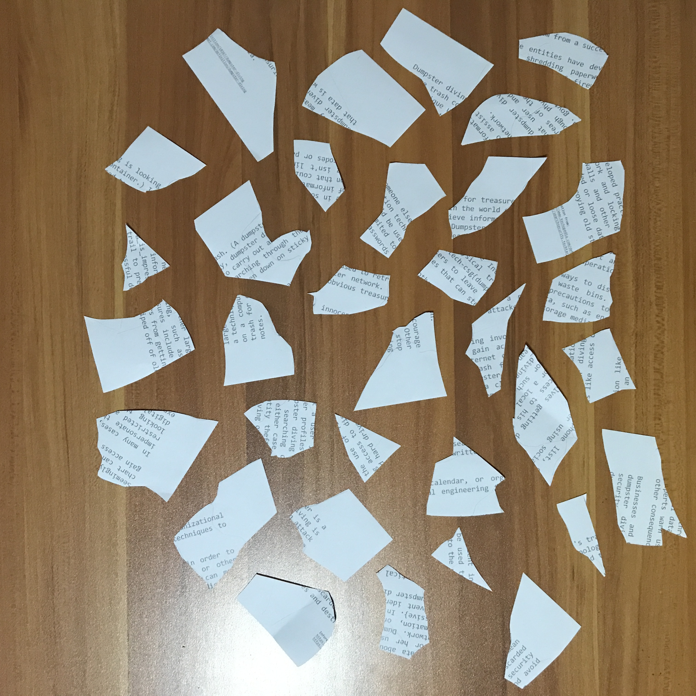
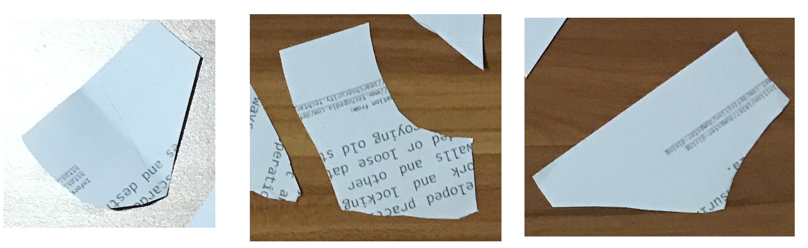
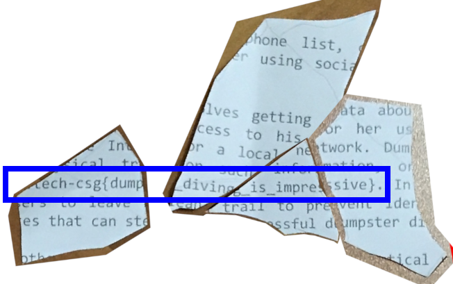

# Diving in
Misc

## Challenge 

We found some papers in the bin. Retrieve the flag!

## Solution

We are given some torn up paper

Look through carefully, these are the pieces with underscores in it. I can infer that it is the flag.

Piece the papers together.

And rotate it in place

## Flag

	govtech-csg{dumpster_diving_is_impressive}
