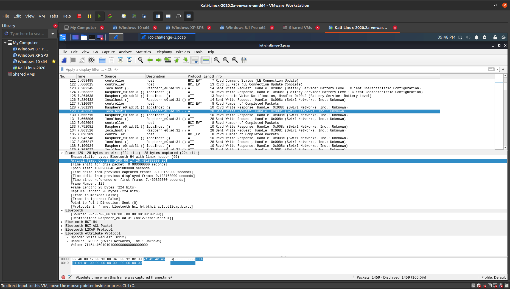
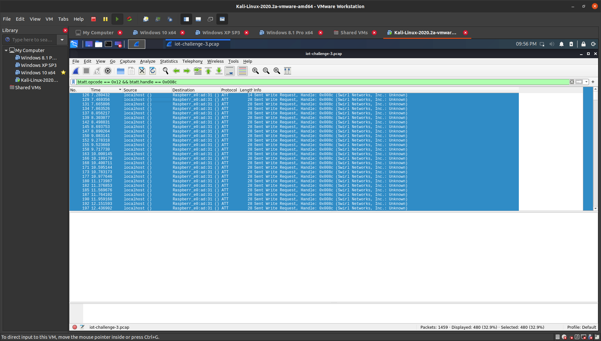
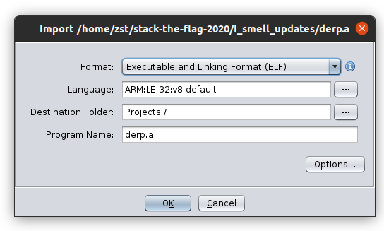

# I smell updates!
Internet Of Things

## Challenge 

iot-challenge-3

Agent 47, we were able to retrieve the enemy's security log from our QA technician's file! It has come to our attention that the technology used is a 2.4 GHz wireless transmission protocol. We need your expertise to analyse the traffic and identify the communication between them and uncover some secrets! The fate of the world is on you agent, good luck.

## Solution

Open up in wireshark. This is a typical Bluetooth LE communication is being captured.

When you filter for different transactions. You will realise that there are some Writes to Characteristics.

Use this Wireshark Filter to see Writes only

	btatt.opcode == 0x12

I see an ELF is written to handle 0x008c. Some sort of OTA update for the device?

Add a filter for that handle also. This is the resulting filter I used to get all the OTA update packets.
	
	btatt.opcode == 0x12 && btatt.handle == 0x008c

Now you will see all the packets.

There's no way to export it directly as a binary. So we can export as a plaintext packet dissection first

- File > Export packet dissections > As plain text

To extract only the ELF binary file, I first wrote this in a Terminal to get the values only. It finds the lines with "Value:" and takes only the hex string from it.

	$ cat packet_dissection.txt 
		| grep Value: 
		| sed s/"    Value: "// 
		| tr -d '\n' 
		> values_only.txt

Convert the hexdump to binary file

	$ cat values_only.txt | xxd -r -p > derp.a

And we get an ARM binary file.

	$ file derp.a 
	derp.a: ELF 32-bit LSB executable, ARM, EABI5 version 1 (SYSV), dynamically linked, interpreter /lib/ld-linux-armhf.so.3, for GNU/Linux 2.6.32, BuildID[sha1]=d73f4011dd87812b66a3128e7f0cd1dcd813f543, not stripped

Decompile in Ghidra.

You can see in main(), there are 2 strings (just for your info)

	- Sorry wrong secret! An alert has been sent!
	- Authorised!

There is an input that checks the first 7 chars that are entered. I slowly reversed the logic into this...

Here is roughly what I got:

	if (input[0] == magic(0x69 - 8))          count += 1;
	if (input[1] == magic(0x27 ^ 0x69))   count += 1;
	if (input[2] == magic(0x0b + 0x69))   count += 1;
	if (input[3] == magic((input[1] & 0x7f) * 2 - 0x33)   count += 1;
	if (input[4] == magic(0x42)   count += 1;
	if (input[5] == magic((count-1)*8 | 1)   count += 1;
	local_17 = ((input[4] + input[5] + input[3]) ^ input[3] + input[5] + 0x42) + 0x65;
	if (input[6] == magic(local_17)   count += 1;

With reference to the Ghidra decompiled code, I then copied all the functions related to magic() into a python script and implemented the above if-statements.

[get_flag.py](get_flag.py)

The flag is printed out when I run it

	aNtiB!e

## Flag

	govtech-csg{aNtiB!e}
