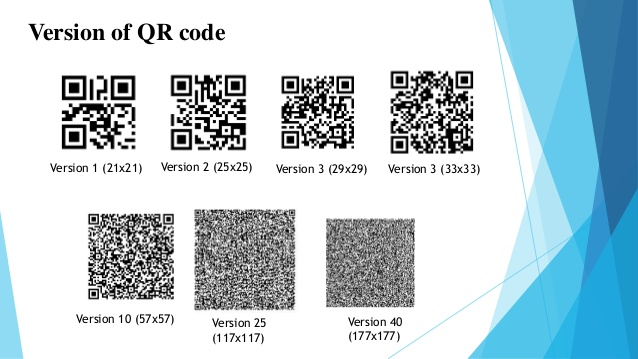
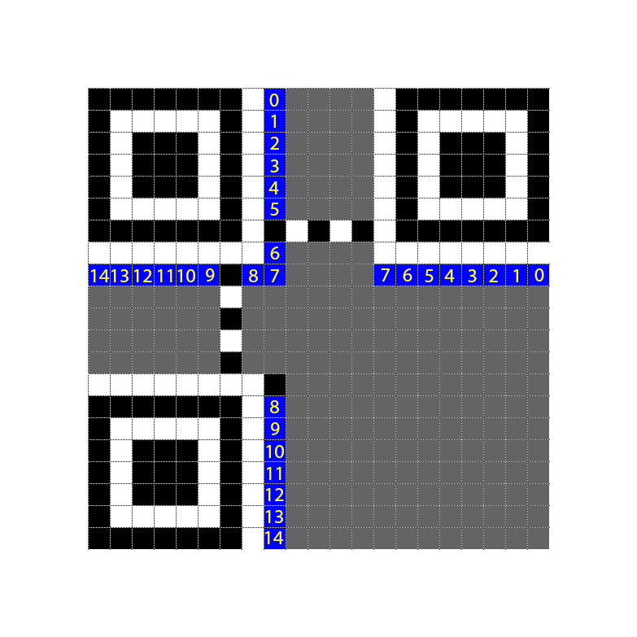
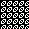
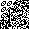

# REconstrucQ
Misc

## Challenge 
misc-challenge-4

As part of forensic investigations into servers operated by COViD, an investigator found this picture of a partially torn paper containing a QR Code. Can you recover the data within the QR Code?

## Solution

It is the size of 29x29. We can conclude it is a 29x29 Version 3 QR code.

Some references for fixing format string

	https://github.com/zst-ctf/gryphonctf-2017-writeups/blob/75fcfcb2095706db9bc488b67342134e8d62e3ef/Solved/The_Mooncake_Box/README.md

	https://writeups.amosng.com/2016/gryphonctf_2016/misc/i-need-you_25/

This is after fixing the format string. But still it doesn't scan

This is because part of the data bits are already torn off. It is highlighted in red here.

But most of the data bits are already there, so it can be extracted by hand.

From the format string, you can tell it uses a mask of 6..

So I wrote a script to apply the mask

And then iterate through the bits to get the flag

Here, this is the payload we extracted, but note that there is one bit at the edge of the torn off portion.

govtech-csg{QR_3rr0r_R;c0v3ry_M4giC!}

So some context is used to get the flag.

[Video](./solution/solution-visual.mp4)

References on how to manually read the QR code

- https://addaxsoft.com/blog/hacking/decoding-an-incomplete-qrcode-intigriti-hacking-challenge-at-brucon/
- https://www.robertxiao.ca/hacking/ctf-writeup/mma2015-qrcode/

## Flag

	govtech-csg{QR_3rr0r_R3c0v3ry_M4giC!}
